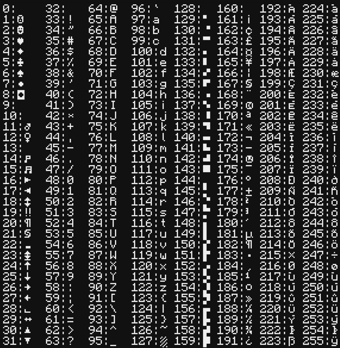

# HUD Glasses — Lua API

🇬🇧 [English version](API.md)

Тип периферии: **`hud_glasses`**.

```lua
local hud = peripheral.find("hud_glasses")
if not hud then error("HUD modem not found on the network") end
```

Большинство методов **бинарно совместимы** с CC `monitor` / `term`. Скрипт для
монитора почти всегда работает на HUD без изменений.

---

## Оглавление

| Раздел | Методы |
|---|---|
| [Запись текста](#запись-текста)        | `write`, `blit`, `clear`, `clearLine`, `scroll` |
| [Курсор](#курсор)                       | `getCursorPos`, `setCursorPos`, `getCursorBlink`, `setCursorBlink` |
| [Размер](#размер)                       | `getSize`, `setSize`, `setWidth`, `setHeight`, `resetSize` |
| [Перекрытие настроек](#перекрытие-настроек-отображения) | `getTextShadow`, `setTextShadow`, `getHudFit`, `setHudFit`, `getShadowLayer`, `setShadowLayer` |
| [Цвета пера](#цвета-пера)               | `getTextColour`, `setTextColour`, `getBackgroundColour`, `setBackgroundColour`, `isColour` |
| [Палитра](#палитра)                     | `getPaletteColour`, `setPaletteColour` |
| [Привязка / идентификация](#привязка--идентификация) | `getId`, `getOwner`, `getOwners`, `getOwnerCount` |
| [Поведение и ошибки](#поведение-и-ошибки) | сводка |
| [Примеры](#примеры)                     | готовые скрипты |
| [Отличия от monitor](#отличия-от-monitor) | |

---

## Запись текста

### `write(text)`

Пишет `text` в текущей позиции курсора текущим цветом пера. После записи курсор
сдвигается на `#text` вправо. Если курсор уехал за правый край — символы тихо
отбрасываются.

Аргумент **coerce'ится** — `42`, `true`, `nil` (→ `"nil"`) тоже подходят.

```lua
hud.setCursorPos(1, 1)
hud.write("HP: ")
hud.write(20)
```

---

### `blit(text, fgColours, bgColours)`

Пишет блок символов сразу с per-cell цветами. Все три аргумента — строки
**одинаковой длины** (CC передаёт их как `ByteBuffer`, скрипт пишет обычные
строки).

- `text` — символы (1 байт на ячейку)
- `fgColours` — hex `0..9 a..f` (индекс палитры) на каждую ячейку
- `bgColours` — то же, **плюс** символ `-` означает **прозрачную** ячейку фона

```lua
hud.setCursorPos(1, 3)
hud.blit("WARN",
         "eeee",     -- весь текст красный (e = colors.red)
         "----")     -- фон прозрачный
```

**Throws** `Arguments must be the same length`, если длины не совпадают.

---

### `clear()`

Заливает весь буфер пробелами текущим `setBackgroundColour`. Если фон
прозрачный (`0`) — экран становится пустым.

### `clearLine()`

То же, но только строка, на которой курсор.

---

### `scroll(y)`

Сдвигает все строки на `y`. `y > 0` — содержимое уходит вверх (внизу появляются
пустые строки текущим фоном пера), `y < 0` — наоборот. `|y| ≥ height`
эквивалентно `clear()`.

```lua
hud.scroll(1)   -- прокрутить вверх на одну строку
```

---

## Курсор

### `getCursorPos() → x, y`

Возвращает текущую позицию курсора. **1-based**: `(1, 1)` — левый верхний угол.

### `setCursorPos(x, y)`

Перемещает курсор. Значения вне диапазона допустимы — следующая запись просто
ничего не отрисует за пределами буфера.

### `getCursorBlink() → blink`

Возвращает флаг «курсор мигает».

### `setCursorBlink(blink)`

Устанавливает флаг. **Замечание:** сейчас курсор визуально не рисуется на HUD —
флаг хранится только ради совместимости с библиотеками, которые его читают/пишут.

---

## Размер

Буфер — это сетка символов. Как она ложится на экран игрока — выбор *клиента*,
настройка `hudFit`: `FIT` (пропорции, поля по краям, дефолт), `STRETCH` (на весь
экран, может искажать) или `COVER` (заполнить с обрезкой). Скрипт управляет
только размером сетки; режим вписывания каждый зритель задаёт сам. Сетка близкая
к 16:9 (например 80×28) чисто заполняет широкоформатный монитор в любом режиме.

### `getSize() → width, height`

Возвращает текущий размер сетки **в символах** (не в пикселях). Меньше клеток —
крупнее каждый символ.

### `setSize(width, height)`

Меняет разрешение этого конкретного модема. Содержимое буфера при этом
**очищается**.

- `width` ∈ `[4, 256]`
- `height` ∈ `[1, 128]`
- иначе → `LuaException`.

После вызова модем «помечен» как кастомный — изменения `hudWidth`/`hudHeight` в
`hudglassescc-common.toml` его больше не трогают. Размер хранится в NBT блока,
переживает рестарт сервера, поршни и Sable sub-level.

```lua
hud.setSize(60, 20)
```

### `setWidth(width)` / `setHeight(height)`

Удобство: меняет только одну ось, вторую оставляет как есть. Те же границы.

### `resetSize()`

Снимает «кастомный» флаг и возвращает размер к текущим значениям
`hudWidth`/`hudHeight` из конфига. Содержимое очищается.

---

## Перекрытие настроек отображения

Позволяют **компьютеру** принудительно задать клиентскую настройку отображения для
всех, кто носит привязанные к этому модему очки — удобно для диспетчерской, где нужен
единый вид. Каждый сеттер также принимает `"auto"`, что возвращает управление
собственному клиентскому конфигу зрителя. **`"auto"` — значение по умолчанию для всех
трёх.**

Перекрытия задаются **на каждый модем**, сохраняются при перезапуске (как `setSize`) и
**никогда не меняют конфиг-файл игрока** — они действуют только пока игрок смотрит на
этот модем. Снял очки (или привязал другой модем) — перекрытие сбрасывается.

> Выбор зрителя в **Mods → CC: HUD Glasses → Config** — это запасной вариант;
> перекрытие здесь имеет приоритет, пока не вернёшь `"auto"`.

### `setTextShadow(style)`

Принудительно задаёт стиль тени текста. `style` (без учёта регистра): `"auto"`,
`"none"`, `"shadow"`, `"outline"`. **Бросает** `LuaException` на любом другом значении.

### `getTextShadow() → style`

Возвращает текущее перекрытие строкой — `"auto"`, если не задано.

### `setHudFit(fit)`

Задаёт, как сетка масштабируется на экран. `fit`: `"auto"`, `"fit"`, `"stretch"`,
`"cover"` (что делает каждый — см. [Размер](#размер)). Иначе **бросает**.

### `getHudFit() → fit`

Возвращает текущее перекрытие вписывания — `"auto"`, если не задано.

### `setShadowLayer(layer)`

Задаёт, где тень/обводка относительно фона клеток. `layer`: `"auto"`, `"over"`
(фон → тень → текст) или `"under"` (тень → фон → текст). Видно только когда стиль тени
`shadow`/`outline`. **Алиасы:** `setTextShadowLayer`. Иначе **бросает**.

### `getShadowLayer() → layer`

Возвращает `"auto"`, `"over"` или `"under"`. **Алиасы:** `getTextShadowLayer`.

```lua
local hud = peripheral.find("hud_glasses")
hud.setHudFit("stretch")      -- все зрители видят растянутым...
hud.setTextShadow("outline")  -- ...с обводкой...
hud.setShadowLayer("under")   -- ...нарисованной под фоном клеток.
hud.setHudFit("auto")         -- вернуть вписывание собственной настройке зрителя
```

---

## Цвета пера

Аргумент `colour` всегда **CC-bitmask**: степень двойки в `[1, 0x8000]`.
Используйте константы из CC API: `colors.red`, `colors.lime` и т.д. Любое другое
число → `LuaException("Expected color")`.

### `getTextColour() → c`

Возвращает текущий цвет текста (для последующих `write`/`clear`).

**Aliases:** `getTextColor`.

### `setTextColour(c)`

Устанавливает цвет текста.

**Aliases:** `setTextColor`. **Throws** на невалидном цвете.

### `getBackgroundColour() → c`

Возвращает текущий цвет фона. **`0`** означает прозрачный (HUD-расширение).

**Aliases:** `getBackgroundColor`.

### `setBackgroundColour(c)`

Устанавливает цвет фона. **HUD-расширение:** аргумент `0` делает фон
**прозрачным** — `clear()` тогда оставляет экран пустым, а `write` не рисует
подложку под символами. Любой другой `c` — обычный цвет CC.

**Aliases:** `setBackgroundColor`. **Throws** на цвете, который не `0` и не
валидный CC-bitmask.

### `isColour() → true`

Всегда возвращает `true` (HUD поддерживает все 16 цветов).

**Aliases:** `isColor`, `getIsColour`, `getIsColor`.

---

## Палитра

У каждого модема — своя 16-цветная палитра, которую можно перенастраивать.

### `getPaletteColour(c) → r, g, b`

Возвращает три числа в `[0, 1]` (RGB-компоненты текущей палитры для цвета `c`).

**Aliases:** `getPaletteColor`.

```lua
local r, g, b = hud.getPaletteColour(colors.red)
```

### `setPaletteColour(c, ...)`

Меняет один из 16 цветов. Два варианта вызова:

```lua
-- RGB-int
hud.setPaletteColour(colors.red, 0xFF8800)

-- три float-а в [0..1]
hud.setPaletteColour(colors.red, 1.0, 0.5, 0.0)
```

**Aliases:** `setPaletteColor`. **Throws** при невалидном цвете или неверном
числе аргументов.

Изменённая палитра живёт **только в RAM** буфера — сбрасывается к дефолтной при
`setSize` / `resetSize`.

---

## Привязка / идентификация

> **Привязка живёт на очках.** ПКМ по модему очками в руке записывает id модема в
> сам предмет. Кто наденет эти очки (слот очков Curios или шлем) — тот видит HUD.
> Передал очки другому игроку → HUD «переезжает» вместе с ними. Один модем могут
> смотреть сколько угодно игроков одновременно.

### `getId() → id`

Возвращает **стабильный** ID модема (число). Не меняется при перемещении, толчке
поршнем, переезде в Sable sub-level (Create Aeronautics). Этот же ID показан в
тултипе очков (`Bound to modem #N`).

```lua
print("This is modem #" .. hud.getId())
```

### `getOwner() → name`

Возвращает ник **первого текущего зрителя** (кто сейчас носит привязанные очки)
или `nil`, если никто не смотрит.

### `getOwners() → table`

Возвращает Lua-таблицу ников **текущих зрителей** — игроков онлайн, которые прямо
сейчас носят очки, привязанные к этому модему.

```lua
for _, name in ipairs(hud.getOwners()) do
    print(name)
end
```

### `getOwnerCount() → n`

Сколько игроков сейчас смотрят этот модем.

---

## Поведение и ошибки

### Что бросает `LuaException`

| Метод | Когда |
|---|---|
| `setTextColour` / `setBackgroundColour` | цвет не валидный CC-bitmask (для bg `0` тоже валиден) |
| `setPaletteColour` | цвет невалидный или странное число аргументов |
| `setSize` / `setWidth` / `setHeight` | вне `[4..256] × [1..128]` |
| `blit` | разные длины `text`/`fg`/`bg` |

### Что обрабатывается **тихо** (ничего не происходит, но без ошибки)

| Ситуация | Поведение |
|---|---|
| Никто не носит привязанные очки | Запись копится в буфере. Кто наденет — сразу увидит текущее состояние. |
| Игрок снял очки | HUD у него пропадает. Надел снова — снова видит. |
| Очки переданы другому игроку | HUD «переезжает»: новый владелец видит то же самое. |
| Игрок вне `maxRangeBlocks` | Кадр «замораживается». Зайдёт в радиус — получит свежий. |
| `write("")` или `write` за пределами экрана | No-op. |

Это сознательное решение: peripheral **никогда** не падает из-за состояния
получателя. Скрипт пишет в буфер, доставка — отдельная забота сервера.

---

## Примеры

### 1. Минимум: «Hello, HUD!»

```lua
local hud = peripheral.find("hud_glasses")
hud.setBackgroundColour(0)
hud.setTextColour(colors.lime)
hud.setCursorPos(1, 1)
hud.write("Hello, HUD!")
```

### 2. Часы по центру

```lua
local hud = peripheral.find("hud_glasses")
hud.setBackgroundColour(0)
hud.setTextColour(colors.white)

while true do
    local text = textutils.formatTime(os.time(), true)
    local w, h = hud.getSize()
    local x = math.floor((w - #text) / 2) + 1
    local y = math.floor(h / 2)
    hud.clear()
    hud.setCursorPos(x, y)
    hud.write(text)
    sleep(1)
end
```

### 3. Цветная полоса с `blit`

```lua
local hud = peripheral.find("hud_glasses")
local w, h = hud.getSize()
local label = " STATUS: OK "
local pad = math.floor((w - #label) / 2)

hud.setCursorPos(1, h)
hud.blit(string.rep(" ", pad) .. label .. string.rep(" ", w - pad - #label),
         string.rep("0", w),                      -- весь текст белый
         string.rep("d", w))                      -- весь фон зелёный
```

### 4. Адаптивный layout: меняем разрешение динамически

```lua
local hud = peripheral.find("hud_glasses")

local function showLarge(text)
    hud.setSize(40, 10)             -- крупно
    hud.setBackgroundColour(0)
    hud.clear()
    hud.setTextColour(colors.red)
    local w, h = hud.getSize()
    hud.setCursorPos(math.floor((w - #text) / 2) + 1, math.floor(h / 2))
    hud.write(text)
end

local function showCompact(lines)
    hud.setSize(80, 28)             -- мелко, много строк
    hud.setBackgroundColour(0)
    hud.clear()
    hud.setTextColour(colors.white)
    for i, line in ipairs(lines) do
        hud.setCursorPos(1, i)
        hud.write(line)
    end
end

showLarge("ALERT")
sleep(2)
showCompact({"Power: 80%", "Fuel:  120", "Crew:  3/4"})
```

### 5. Кто смотрит этот HUD

```lua
local hud = peripheral.find("hud_glasses")
print("Modem #" .. hud.getId() .. " is watched by:")
for _, name in ipairs(hud.getOwners()) do
    print("  " .. name)
end
```

---

## Отличия от monitor

| Аспект | `monitor` (CC) | `hud_glasses` |
|---|---|---|
| Отображение | физический блок в мире | overlay на экране игрока |
| Зрители | все, кто видит блок | все, кто носит привязанные очки |
| Прозрачный фон | нет | `setBackgroundColour(0)` или `-` в blit |
| Масштаб | `setTextScale(s)` (пиксели) | `setSize(w, h)` (клетки) |
| Размер | через `setTextScale` + множители блоков | `setSize` + дефолты из конфига |
| Поведение при offline | n/a (блок всегда «есть») | копит буфер, доставит когда сможет |
| Доп. методы | — | `getId`, `getOwners`, `setSize`, `resetSize`, `setHudFit`, `setTextShadow`, `setShadowLayer` |

`setTextScale` / `getTextScale` **не реализованы** — у HUD нет понятия
пиксельного шага, размер задаётся через `setSize`.

Справочник по кодировке символов (CC-шрифт в стиле CP437, адресуется по байту):
[CHARS.md](CHARS.md).


